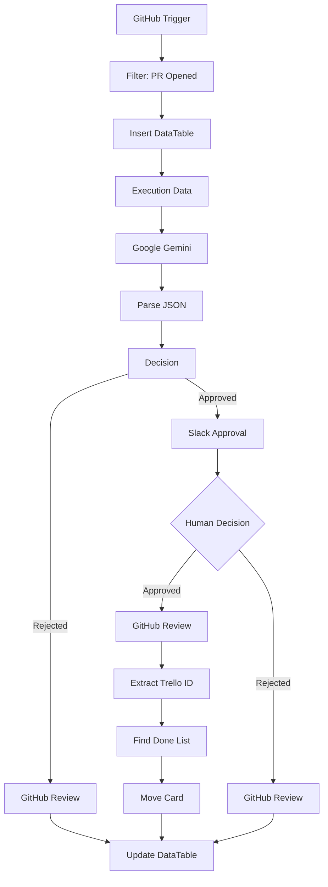

# 🤖 AI-Powered Pull Request Review Automation
### Intelligent CI Workflow with n8n, Google Gemini, GitHub, Slack & Trello

> AI-assisted code review workflow that automates Pull Request validation, incorporates **Human-in-the-Loop** approval, and synchronizes project status across GitHub, Slack, Trello, and n8n DataTables.

---

<p align="center">
  <a href="https://n8n.io/"></a>
  <a href="https://gemini.google.com/"></a>
  <a href="https://github.com/"></a>
  <a href="https://slack.com/"></a>
  <a href="https://trello.com/"></a>
  <a href="https://mail.google.com/"></a>
  <a href="https://developer.mozilla.org/en-US/docs/Web/JavaScript"></a>
</p>

---

## 📌 Overview

This project implements an AI-powered Continuous Integration (CI) workflow using **n8n**.

When a Pull Request is opened, the workflow automatically analyzes the submitted code using **Google Gemini**, validates it against predefined engineering best practices, and decides whether it should continue to human approval or be rejected immediately.

If AI approves the Pull Request, the workflow requests final approval from a technical reviewer through **Slack Interactive Messages**. Once approved, GitHub, Trello, and the internal audit log are updated automatically.

The objective is to reduce repetitive manual reviews while maintaining human oversight for critical development decisions.

---

# 🚀 Features

- ✅ GitHub Pull Request Trigger
- ✅ AI-powered code review with Google Gemini
- ✅ Structured JSON output parsing
- ✅ Human-in-the-loop approval via Slack
- ✅ Automatic GitHub Review creation
- ✅ Gmail notifications
- ✅ Trello synchronization
- ✅ Internal audit logging with n8n DataTables
- ✅ Fully automated workflow orchestration

---

# 🛑 Problem

Code reviews frequently become a bottleneck during software development.

Engineering teams spend significant time reviewing repetitive coding standards while constantly switching between GitHub, Slack, Trello, and project management tools.

This context switching slows development and makes project tracking harder.

---

# 💡 Solution

This workflow automates the first stage of Pull Request validation.

Whenever a developer opens a Pull Request:

1. GitHub triggers the workflow.
2. The PR metadata is stored in n8n DataTables.
3. Source code is analyzed by Google Gemini.
4. Gemini returns a structured JSON decision.
5. The workflow evaluates the response.
6. If rejected, GitHub receives an automatic review.
7. If approved, Slack requests confirmation from a human reviewer.
8. Once approved:
   - GitHub Review is submitted
   - Trello card moves to **Done**
   - DataTables are updated
   - Audit trail is completed

This approach combines AI automation with human decision-making, following enterprise Human-in-the-Loop patterns.

---

# 🏗️ High-Level Architecture

```text
                 GitHub Pull Request
                         │
                         ▼
                 GitHub Trigger (n8n)
                         │
                         ▼
                  Store Execution Log
                  (DataTables)
                         │
                         ▼
                 Google Gemini Review
                         │
                  JSON Decision
                         │
              ┌──────────┴──────────┐
              │                     │
              ▼                     ▼
        AI Reject             AI Approves
              │                     │
              ▼                     ▼
      GitHub Review          Slack Approval
                                    │
                           ┌────────┴────────┐
                           ▼                 ▼
                    Human Reject      Human Approves
                           │                 │
                           ▼                 ▼
                     GitHub Review    GitHub Approval
                                             │
                                             ▼
                                     Update Trello
                                             │
                                             ▼
                                    Update DataTables
```

---

# 🔄 Workflow Architecture (n8n)



---

# ⚙️ Technologies

| Category | Technologies |
|-----------|--------------|
| Workflow Automation | n8n |
| AI | Google Gemini |
| Source Control | GitHub |
| Collaboration | Slack |
| Project Management | Trello |
| Email | Gmail |
| Programming | JavaScript |
| Data Storage | n8n DataTables |

---

# 🔄 Workflow Logic

## Step 1

GitHub detects a newly opened Pull Request.

---

## Step 2

The execution is registered in DataTables.

---

## Step 3

Google Gemini evaluates the submitted code according to predefined software engineering guidelines.

---

## Step 4

Gemini returns a structured JSON response.

Example:

```json
{
  "approved": true,
  "score": 9,
  "feedback": "Well structured code."
}
```

---

## Step 5

If the code is rejected:

- GitHub receives an automatic review.
- Execution status is updated.

---

## Step 6

If approved:

- Gmail notification is sent.
- Slack requests human approval.

---

## Step 7

After human approval:

- GitHub Review is submitted.
- Trello card moves to **Done**.
- Audit log is updated.

---

# 📊 Workflow Outcome

The implemented workflow provides:

- Automated first-pass code review
- AI-assisted development process
- Human validation before merge
- Automated project synchronization
- Centralized execution logging
- Reduced manual coordination between tools

---

# 📷 Screenshots

### Workflow en n8n

*Vista del workflow orquestado en n8n con integración a GitHub, Gemini, Slack, Trello y Gmail.*

---

### Aprobación en Slack

*Mensaje en Slack solicitando aprobación humana con el análisis de la IA y botones interactivos.*

---

### Revisión en GitHub

*Comentario automático generado por la IA en el Pull Request.*

---

### Tarjeta en Trello

*Tarjeta movida a la lista "Hecho" después de la aprobación final.*

---

### Rechazo por IA en Slack

*Mensaje en Slack cuando la IA rechaza automáticamente el Pull Request.*

---

# 📁 Repository Structure

```
.
├── README.md
├── workflow.json
├── docs
├── screenshots
│   ├── workflow.png
│   ├── slack.png
│   ├── github-review.png
│   └── trello.png
└── assets
```

---

# 🔮 Future Improvements

- Remove the testing node that forces AI approval.
- Improve Slack rejection workflow.
- Replace Trello ID extraction with Regex validation.
- Add try/catch handling for malformed AI responses.
- Implement retry logic for external APIs.
- Add monitoring and execution metrics.
- Store execution history in PostgreSQL.
- Generate review reports automatically.

---

# 💼 Skills Demonstrated

- AI Workflow Orchestration
- Human-in-the-Loop Systems
- GitHub Automation
- Continuous Integration (CI)
- LLM Integration
- Prompt Engineering
- API Integration
- Workflow Automation
- Event-Driven Architecture
- JavaScript
- Enterprise Process Automation

---

# 📜 License

MIT License

---

## 👤 Author

**Fausto Enrique Soto Euraque**

AI Engineer | Data Scientist | Automation Engineer

- LinkedIn: https://linkedin.com/in/fsotoeu
- GitHub: https://github.com/fsotoeu-cyber


