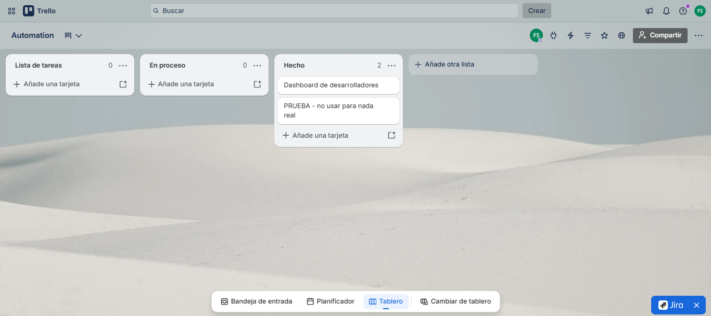

<div align="center">
  <p>
    <a href="#-english-version">🇬🇧 English</a> | <a href="#-versión-en-español">🇪🇸 Español</a>
  </p>
</div>

---

# 🇬🇧 English Version

# 🤖 AI-Powered Pull Request Review Automation
### Intelligent CI Workflow with n8n, Google Gemini, GitHub, Slack & Trello

> AI-assisted code review workflow that automates Pull Request validation, incorporates **Human-in-the-Loop** approval, and synchronizes project status across GitHub, Slack, Trello, and n8n DataTables.

---

<p align="center">
  <a href="https://n8n.io/"></a>
  <a href="https://gemini.google.com/"></a>
  <a href="https://github.com/"></a>
  <a href="https://slack.com/"></a>
  <a href="https://trello.com/"></a>
  <a href="https://mail.google.com/"></a>
  <a href="https://developer.mozilla.org/en-US/docs/Web/JavaScript"></a>
</p>

---

## 📌 Overview

This project implements an AI-powered Continuous Integration (CI) workflow using **n8n**. 

When a Pull Request is opened, the workflow automatically analyzes the submitted code using **Google Gemini**, validates it against predefined engineering best practices, and decides whether it should continue to human approval or be rejected immediately.

If the AI approves the Pull Request, the workflow requests final approval from a technical lead through **Slack Interactive Messages**. Once approved, GitHub, Trello, and the internal audit logs are updated automatically.

**The objective:** Reduce manual code review bottlenecks and context-switching while maintaining strict human oversight for critical development decisions.

---

## 🛑 The Problem

Code reviews frequently become a severe bottleneck during the software development life cycle. Engineering teams spend significant dev-hours reviewing repetitive coding standards and constantly switching contexts between GitHub, Slack, Trello, and project management tools. This friction slows down deployments and makes project tracking highly inefficient.

## 💡 The Solution & Business Value

This workflow automates the first stage of Pull Request validation, functioning as an intelligent filter before a human reviewer steps in. 

* **Increases Dev Velocity:** Eliminates time spent on initial syntax and standard checks.
* **Reduces Context Switching:** Developers approve or reject directly from Slack without opening GitHub or Trello.
* **Maintains Security & Quality:** Enforces a strictly audited *Human-in-the-Loop* pattern for final deployment decisions.

---

## 🚀 Features

- ✅ **Event-Driven:** GitHub Pull Request Trigger.
- ✅ **AI Code Review:** Automated semantic analysis with Google Gemini.
- ✅ **Structured Output:** Deterministic JSON decision parsing.
- ✅ **Human-in-the-Loop:** Interactive approval via Slack UI blocks.
- ✅ **CI/CD Integration:** Automatic GitHub Review creation (Approve/Request Changes).
- ✅ **Project Sync:** Trello card status automation.
- ✅ **Audit Logging:** Centralized execution history using n8n DataTables.

---

## 🏗️ High-Level Architecture

```text
                 GitHub Pull Request
                         │
                         ▼
                 GitHub Trigger (n8n)
                         │
                         ▼
                 Store Execution Log
                 (DataTables)
                         │
                         ▼
                 Google Gemini Review
                         │
                 JSON Decision Output
                         │
              ┌──────────┴──────────┐
              │                     │
              ▼                     ▼
          AI Reject             AI Approves
              │                     │
              ▼                     ▼
        GitHub Review         Slack Approval
                                    │
                           ┌────────┴────────┐
                           ▼                 ▼
                     Human Reject      Human Approves
                           │                 │
                           ▼                 ▼
                     GitHub Review     GitHub Approval
                                             │
                                             ▼
                                       Update Trello
                                             │
                                             ▼
                                    Update DataTables

---

## 🔄 Workflow Logic

1. **Trigger:** GitHub detects a newly opened Pull Request.
2. **Audit Initialization:** The execution is instantly registered in n8n DataTables.
3. **AI Evaluation:** Google Gemini evaluates the submitted source code according to predefined software engineering guidelines and returns a structured JSON response (e.g., `{"approved": true, "score": 9, "feedback": "Well structured code."}`).
4. **Branching Decision:**
   * **If Rejected by AI:** GitHub receives an automatic code review requesting changes. Execution is logged and terminated.
   * **If Approved by AI:** A Gmail notification is triggered, and Slack requests final human validation via interactive buttons.
5. **Human-in-the-Loop (Final Resolution):** Upon manual action in Slack, the GitHub Review is officially submitted, the associated Trello card moves to "Done", and the audit log is updated to reflect the human decision.

---

## 📷 Workflow Showcase

### n8n Orchestration

*Complete orchestrated workflow in n8n integrating GitHub, Gemini, Slack, Trello, and Gmail.*

### Slack Interactive Approval

*Slack interactive message requesting human approval based on the AI analysis.*

### Automated GitHub Review

*Automated AI-generated comment and review status on the GitHub Pull Request.*

### Trello Synchronization

*Trello card automatically moved to the "Done" list after final human approval.*

### Automated AI Rejection

*Slack notification triggered when the AI autonomously rejects a Pull Request.*

---

## 🔮 Future Improvements

- [ ] Remove the testing node that forces AI approval.
- [ ] Refine the Slack rejection UI/UX workflow.
- [ ] Replace standard Trello ID extraction with robust Regex validation.
- [ ] Implement `try/catch` error handling for malformed LLM JSON responses.
- [ ] Add monitoring and execution metrics dashboards.
- [ ] Migrate execution history storage to PostgreSQL.

---

## 💼 Skills Demonstrated

`AI Workflow Orchestration` `Human-in-the-Loop Systems` `CI/CD Automation` `LLM Integration` `Prompt Engineering` `Event-Driven Architecture` `JavaScript` `API Integration`

---

## 📜 License

MIT License

---

## 👤 Author

**Fausto Enrique Soto Euraque**

*Data Scientist | AI Engineer | Automation Specialist*

- **LinkedIn:** [linkedin.com/in/fausto-soto](https://linkedin.com/in/fausto-soto)
- **GitHub:** [github.com/fsoto21](https://github.com/fsoto21) | [github.com/fsotoeu-cyber](https://github.com/fsotoeu-cyber)
