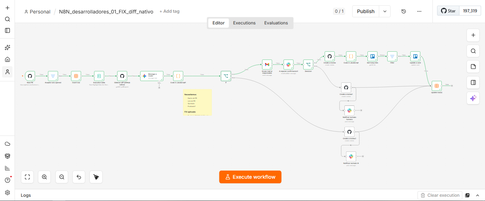
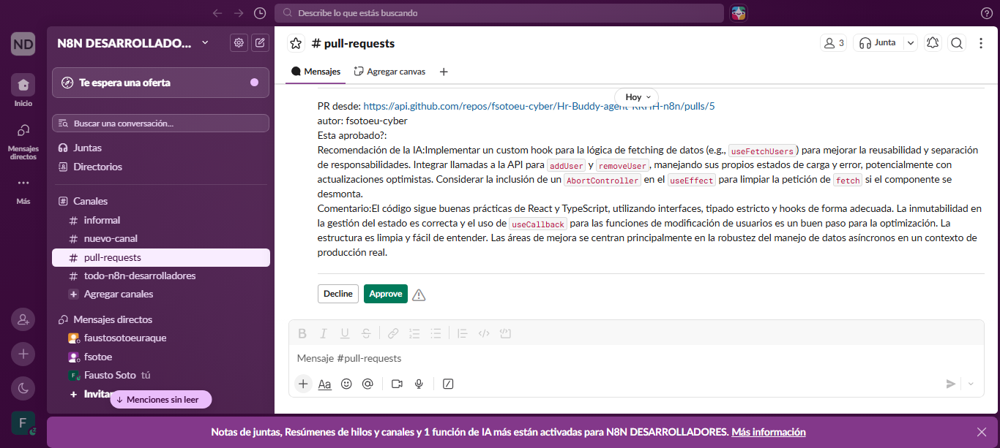
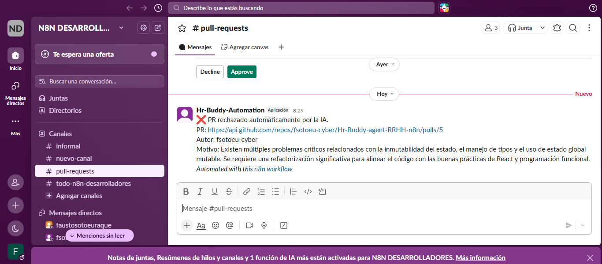
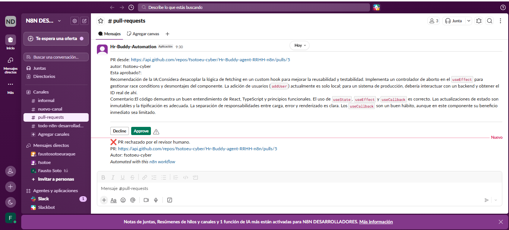
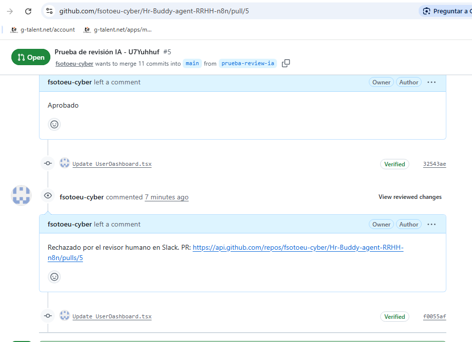

<div align="center">
  <p>
    <a href="#-english-version">🇬🇧 English</a> | <a href="#-versión-en-español">🇪🇸 Español</a>
  </p>
</div>

---

# 🇬🇧 English Version

# 🤖 AI-Powered Pull Request Review Automation
### Intelligent CI Workflow with n8n, Google Gemini, GitHub, Slack & Trello

> AI-assisted code review workflow that automates initial Pull Request analysis, incorporates conditional **Human-in-the-Loop** validation, and synchronizes the final outcome across GitHub, Slack, Trello, and n8n DataTables.

---

<p align="center">
  <a href="https://n8n.io/"></a>
  <a href="https://gemini.google.com/"></a>
  <a href="https://github.com/"></a>
  <a href="https://slack.com/"></a>
  <a href="https://trello.com/"></a>
  <a href="https://mail.google.com/"></a>
  <a href="https://developer.mozilla.org/en-US/docs/Web/JavaScript"></a>
</p>

---

## 📌 Overview

This project implements an automated Pull Request review workflow using **n8n** as the orchestration engine and **Google Gemini** for initial code analysis.

When a developer opens a Pull Request, the workflow receives the event from GitHub, logs the execution in **n8n DataTables**, and sends the relevant information to Gemini to generate a structured evaluation.

Based on the AI's analysis, the workflow follows one of two paths:
- **If AI rejects the PR:** The automatic rejection route is executed immediately.
- **If AI approves the PR:** The process moves to a **Human-in-the-Loop** stage, where a human reviewer makes the final decision to approve or reject.

The architecture perfectly combines AI-driven automation with conditional human oversight and state synchronization across GitHub, Slack, Trello, and internal logs.

---

## 🎯 Objective

Automate the first stage of code review and reduce repetitive coordination tasks, while maintaining strict human intervention for Pull Requests that pass the initial AI evaluation. 

This workflow demonstrates enterprise-level integration of:
- Event-Driven Automation
- LLM Integration & Prompt Engineering
- Human-in-the-Loop (HITL) Architecture
- Project Management & CI/CD Synchronization
- Execution Logging & Traceability

---

## 🚀 Features

- ✅ **GitHub Pull Request Trigger**
- ✅ **AI-assisted code review** with Google Gemini
- ✅ **Structured JSON output** parsing
- ✅ **Conditional decision routing**
- ✅ **Automatic AI rejection** pipeline
- ✅ **Human-in-the-Loop approval** via interactive Slack UI
- ✅ **GitHub Review automation**
- ✅ **Trello board synchronization**
- ✅ **Internal execution logging** via n8n DataTables
- ✅ **Fully tested logic:** Three main decision routes implemented and validated.

---

## 🛑 The Problem

Manual code review easily becomes a bottleneck in the software development lifecycle. Technical teams must review PRs, communicate decisions, update management tools, and maintain traceability.

Constant context-switching between GitHub, Slack, and Trello generates:
- Repetitive manual processes.
- Increased coordination overhead.
- State desynchronization between tools.
- Loss of decision traceability.

---

## 💡 The Solution

This workflow automates the crucial first filter. When a PR is opened:
1. GitHub triggers the workflow.
2. Execution state is initialized in DataTables.
3. Code is sent to Gemini for analysis.
4. Gemini returns a structured JSON decision.
5. If the AI rejects, an automatic feedback loop requests changes.
6. If the AI approves, Slack requests validation from a human lead.
7. Upon human approval, GitHub, Trello, and DataTables are instantly updated.

---

## 🏗️ High-Level Architecture

```text
                 GitHub Pull Request
                         │
                         ▼
                 GitHub Trigger (n8n)
                         │
                         ▼
                 Execution Logging
                  (DataTables)
                         │
                         ▼
                 Google Gemini Review
                         │
                         ▼
                    AI Decision
                         │
              ┌──────────┴──────────┐
              │                     │
              ▼                     ▼
         AI Reject              AI Approves
              │                     │
              ▼                     ▼
        GitHub Review        Slack Approval
              │                     │
              ▼              Human Decision
        Slack Notification           │
              │             ┌────────┴────────┐
              ▼             │                 │
        Update DataTable    ▼                 ▼
                      Human Reject      Human Approves
                            │                 │
                            ▼                 ▼
                      GitHub Review      GitHub Review
                            │                 │
                            ▼                 ▼
                     Slack Notification  Extract Trello ID
                            │                 │
                            ▼                 ▼
                     Update DataTable    Move Trello Card
                                              │
                                              ▼
                                       Update DataTable
```
---

## ⚙️ Technologies

| Category | Technology |
| :--- | :--- |
| **Workflow Automation** | n8n |
| **AI / LLM** | Google Gemini |
| **Source Control** | GitHub |
| **Collaboration** | Slack |
| **Project Management** | Trello |
| **Email** | Gmail |
| **Programming** | JavaScript |
| **Data Storage** | n8n DataTables |

---

## 🔄 Workflow Logic

### Step 1 — GitHub Trigger
The Workflow activates when GitHub detects a PR-related event. A `Filter` node ensures only specific review-ready events proceed.

### Step 2 — Execution Logging
Initial execution metadata (Owner, PR reference, status) is registered in n8n DataTables to maintain complete traceability.

### Step 3 — AI Code Review
The source code is evaluated by Google Gemini, outputting structured JSON including: `aprobado` (boolean), `recomendacion` (string), and `comentario` (string).

### Step 4 — Parse JSON
A Code node (JavaScript) sanitizes and parses the LLM output into standardized variables for downstream routing.

### Step 5 — AI Decision
The Workflow evaluates the AI's boolean decision:
- ❌ **AI Rejected:** GitHub Review created. Slack notified. Execution logged and terminated.
- ✅ **AI Approved:** Analysis forwarded to a human reviewer via interactive Slack blocks.

### Step 6 — Human-in-the-Loop
Slack presents the PR details, the AI's technical recommendation, and interactive Approval/Rejection buttons.

### Step 7 — Human Decision
- ❌ **Human Rejected:** GitHub Review requesting changes is posted. DataTables updated.
- ✅ **Human Approved:** GitHub Review approved. Trello ID extracted. Trello card automatically moved to the "Done" list. DataTables finalized.

---

## 🧪 Workflow Validation (The 3 Scenarios)

This architecture has been stress-tested across the three primary decision routes:

### ❌ Scenario 1: AI Rejection
The AI detects severe anti-patterns and determines the PR should not proceed.
* **Flow:** Trigger → Gemini → AI Decision: Rejected → GitHub Review → Slack Notification → Update DataTable.
* **Result Validated:** Automatic rejection route executed flawlessly without human bottleneck.

### 👤❌ Scenario 2: AI Approved / Human Rejected
The AI finds no syntax/standard issues, but the human reviewer detects business-logic flaws.
* **Flow:** Trigger → Gemini → AI Decision: Approved → Slack Approval → Human Decision: Rejected → GitHub Review → Update DataTable.
* **Result Validated:** AI approved, but human override successfully halted the merge and requested changes on GitHub.

### 👤✅ Scenario 3: AI Approved / Human Approved
Code is technically sound and meets business logic.
* **Flow:** Trigger → Gemini → AI Decision: Approved → Slack Approval → Human Decision: Approved → GitHub Review → Move Trello Card → Update DataTable.
* **Result Validated:** End-to-end synchronization achieved. PR approved, PM tool updated, audit log completed.

---

## 📷 Screenshots

### 1. Workflow Architecture in n8n

*General view of the implemented n8n workflow and its conditional routing.*

### 2. AI Analysis + Slack Approval

*Interactive Slack message presenting AI recommendations to the human reviewer.*

### 3. Automated AI Rejection

*Slack notification triggered when the AI autonomously rejects a Pull Request.*

### 4. Human Rejection

*Notification corresponding to a manual rejection decision by the human reviewer.*

### 5. Automated GitHub Review

*GitHub Review automatically generated during workflow execution.*

### 6. Trello Synchronization

*Trello card moved to the "Done" list after full approval route completion.*

---

## 🔮 Future Improvements

- [ ] Implement additional LLM JSON output validation schemas.
- [ ] Add robust `try/catch` error handling nodes.
- [ ] Implement retry logic for external APIs (GitHub/Trello rate limits).
- [ ] Improve Trello ID extraction using advanced Regex.
- [ ] Persist execution history in a PostgreSQL database.
- [ ] Build a Looker Studio dashboard for AI vs. Human decision metrics.

---

## 💼 Skills Demonstrated

`AI Workflow Orchestration` `Human-in-the-Loop Systems` `LLM Integration` `Prompt Engineering` `GitHub Automation` `CI/CD Automation` `Event-Driven Architecture` `JavaScript` `Conditional Routing`

---

## 📜 License & Author

**MIT License**

**Fausto Enrique Soto Euraque**  
*AI Engineer | Data Scientist | Workflow Automation*

- **LinkedIn:** [linkedin.com/in/fsotoeu](https://linkedin.com/in/fsotoeu)
- **GitHub:** [github.com/fsotoeu-cyber](https://github.com/fsotoeu-cyber)
  
---

# 🇪🇸 Versión en Español

# 🤖 Automatización de Revisión de Pull Requests con IA
### Workflow Inteligente de CI con n8n, Google Gemini, GitHub, Slack y Trello

> Workflow de revisión de código asistida por IA que automatiza el análisis inicial de Pull Requests, incorpora validación humana mediante **Human-in-the-Loop** y sincroniza el resultado final entre GitHub, Slack, Trello y n8n DataTables.

---

## 📌 Resumen

Este proyecto implementa un Workflow de revisión automatizada de Pull Requests utilizando **n8n** como motor de orquestación y **Google Gemini** para realizar un análisis inicial del código.

Cuando un desarrollador abre un Pull Request, el Workflow recibe el evento desde GitHub, registra la ejecución en **n8n DataTables** y envía la información relevante a Gemini para generar una evaluación estructurada.

A partir del análisis de la IA, el Workflow sigue dos posibles caminos:
- **Si la IA rechaza el PR:** Se ejecuta automáticamente la ruta de rechazo solicitando cambios.
- **Si la IA aprueba el PR:** El proceso continúa hacia una etapa de **Human-in-the-Loop**, donde un revisor humano toma la decisión final de aprobar o rechazar.

La arquitectura combina automatización basada en IA con supervisión humana condicional y sincronización de estado entre repositorios, herramientas de comunicación y gestión de proyectos.

---

## 🎯 Objetivo

Automatizar la primera etapa de revisión de código y reducir tareas repetitivas de coordinación, manteniendo intervención humana estricta cuando el Pull Request supera la evaluación inicial de la IA.

El Workflow demuestra integración a nivel empresarial de:
- Automatización Orientada a Eventos
- Integración de LLMs e Ingeniería de Prompts
- Arquitectura Human-in-the-Loop (HITL)
- Sincronización CI/CD y Project Management
- Trazabilidad y Logs de Ejecución

---

## 🚀 Características

- ✅ **Disparador (Trigger) en GitHub**
- ✅ **Revisión asistida por IA** con Google Gemini
- ✅ **Salida estructurada en JSON**
- ✅ **Enrutamiento condicional de decisiones**
- ✅ **Rechazo automático por IA**
- ✅ **Aprobación Human-in-the-Loop** mediante Slack
- ✅ **Automatización de GitHub Reviews**
- ✅ **Sincronización con Trello**
- ✅ **Registro interno de ejecuciones** con n8n DataTables
- ✅ **Flujos 100% probados:** Tres rutas principales de decisión implementadas y validadas.

---

## 🛑 El Problema

La revisión manual de código suele convertirse en un cuello de botella. Los equipos técnicos deben revisar PRs, comunicar decisiones y actualizar herramientas, lo cual genera fricción.

El cambio constante entre GitHub, Slack y Trello ocasiona:
- Procesos manuales repetitivos.
- Mayor tiempo de coordinación.
- Desincronización entre herramientas.
- Pérdida de trazabilidad sobre las decisiones.

---

## 💡 La Solución

El Workflow automatiza el filtro inicial. Cuando se abre un Pull Request:
1. GitHub activa el Workflow.
2. La ejecución se registra en DataTables.
3. El código se envía a Gemini para análisis.
4. Gemini devuelve un JSON estructurado.
5. Si la IA rechaza, se solicita corrección automáticamente en GitHub.
6. Si la IA aprueba, Slack solicita validación humana interactiva.
7. Al aprobar el humano, GitHub, Trello y los logs se actualizan en segundos.

---

## 🏗️ Arquitectura de Alto Nivel

```text
                 GitHub Pull Request
                         │
                         ▼
                 Trigger de GitHub (n8n)
                         │
                         ▼
             Registro de Ejecución
                  (DataTables)
                         │
                         ▼
               Revisión de Gemini
                         │
                         ▼
                   Decisión de IA
                         │
              ┌──────────┴──────────┐
              │                     │
              ▼                     ▼
          IA Rechaza             IA Aprueba
              │                     │
              ▼                     ▼
      Revisión en GitHub    Aprobación en Slack
              │                     │
              ▼              Decisión Humana
    Notificación en Slack            │
              │             ┌────────┴────────┐
              ▼             │                 │
     Actualizar DataTable   ▼                 ▼
                     Humano Rechaza     Humano Aprueba
                            │                 │
                            ▼                 ▼
                   Revisión en GitHub  Revisión en GitHub
                            │                 │
                            ▼                 ▼
                 Notificación Slack    Extraer ID Trello
                            │                 │
                            ▼                 ▼
                 Actualizar DataTable  Mover Tarjeta Trello
                                              │
                                              ▼
                                      Actualizar DataTable
```
---

## ⚙️ Tecnologías

| Categoría | Tecnología |
| :--- | :--- |
| **Automatización** | n8n |
| **IA / LLM** | Google Gemini |
| **Control de Versiones** | GitHub |
| **Colaboración** | Slack |
| **Gestión de Proyectos** | Trello |
| **Correo** | Gmail |
| **Programación** | JavaScript |
| **Base de Datos** | n8n DataTables |

---

## 🔄 Lógica del Workflow

### Paso 1 — GitHub Trigger
El Workflow se activa ante eventos de Pull Request. Un nodo `Filter` asegura que solo avancen los eventos de apertura pertinentes.

### Paso 2 — Registro de Ejecución
Se registra la metadata (Dueño, Referencia, Estado) en n8n DataTables para asegurar trazabilidad.

### Paso 3 — Revisión de Código por IA
Gemini evalúa el código y devuelve un JSON estructurado con: `aprobado` (booleano), `recomendacion` y `comentario`.

### Paso 4 — Parseo JSON
Un nodo de código (`JavaScript`) limpia la respuesta del LLM y la convierte en variables utilizables.

### Paso 5 — Decisión de la IA
- ❌ **IA Rechaza:** Se crea la revisión en GitHub solicitando cambios. Se notifica en Slack y termina la ejecución.
- ✅ **IA Aprueba:** Se envía el análisis al líder técnico mediante bloques interactivos en Slack.

### Paso 6 — Human-in-the-Loop
Slack presenta los detalles del PR, la recomendación de la IA y botones para aprobar o rechazar.

### Paso 7 — Decisión Humana
- ❌ **Humano Rechaza:** Se envía revisión a GitHub solicitando cambios. Se actualizan logs.
- ✅ **Humano Aprueba:** Se aprueba en GitHub, se extrae el ID de Trello y se mueve la tarjeta a la lista de "Hecho". Se cierra el ciclo en DataTables.

---

## 🧪 Validación del Workflow (Los 3 Escenarios)

El sistema fue probado bajo estrés ejecutando las 3 rutas principales:

### ❌ Escenario 1: Rechazo por IA
La IA detecta malas prácticas y frena el PR.
* **Flujo:** Trigger → Gemini → Decisión IA: Rechazado → GitHub Review → Notificación Slack → Update DataTable.
* **Resultado Validado:** Ruta de rechazo automático ejecutada sin intervención humana.

### 👤❌ Escenario 2: IA Aprueba / Humano Rechaza
Código sintácticamente correcto, pero con fallos de lógica de negocio detectados por el humano.
* **Flujo:** Trigger → Gemini → Decisión IA: Aprobado → Slack → Decisión Humana: Rechazado → GitHub Review → Update DataTable.
* **Resultado Validado:** Aprobación de IA anulada correctamente por el supervisor humano.

### 👤✅ Escenario 3: IA Aprueba / Humano Aprueba
Código impecable a nivel técnico y de negocio.
* **Flujo:** Trigger → Gemini → Decisión IA: Aprobado → Slack → Decisión Humana: Aprobado → GitHub Review → Mover Trello → Update DataTable.
* **Resultado Validado:** Sincronización total End-to-End.

---

## 📷 Capturas de Pantalla

### 1. Arquitectura en n8n

*Vista general del Workflow implementado en n8n y sus rutas condicionales.*

### 2. Análisis de IA + Aprobación en Slack

*Mensaje interactivo enviado al revisor con la recomendación de la IA.*

### 3. Rechazo Automático de IA

*Notificación disparada cuando la IA rechaza el código de forma autónoma.*

### 4. Rechazo Humano

*Notificación correspondiente a la decisión de rechazo del supervisor humano.*

### 5. Revisión Automatizada en GitHub

*Comentario y estado generado automáticamente en GitHub.*

### 6. Sincronización con Trello

*Tarjeta movida a "Hecho" tras completar la ruta de aprobación.*

---

## 🔮 Futuras Mejoras

- [ ] Implementar esquemas de validación estrictos para la salida JSON del LLM.
- [ ] Añadir manejo de errores `try/catch` nativo en n8n.
- [ ] Implementar lógica de reintentos (`retry`) para APIs de GitHub y Trello.
- [ ] Mejorar la extracción del ID de Trello mediante expresiones regulares avanzadas.
- [ ] Persistir el historial de ejecuciones en una base de datos PostgreSQL.
- [ ] Crear un dashboard en Looker Studio para analizar métricas de IA vs. Humano.

---

## 💼 Habilidades Demostradas

`Orquestación de Workflows con IA` `Sistemas Human-in-the-Loop` `Integración de LLMs` `Ingeniería de Prompts` `Automatización CI/CD` `Arquitectura Orientada a Eventos` `JavaScript` `Enrutamiento Condicional`

---

## 📜 Licencia y Autor

**Licencia MIT**

**Fausto Enrique Soto Euraque**  
*AI Engineer | Data Scientist | Workflow Automation*

- **LinkedIn:** [linkedin.com/in/fsotoeu](https://linkedin.com/in/fsotoeu)
- **GitHub:** [github.com/fsotoeu-cyber](https://github.com/fsotoeu-cyber)
